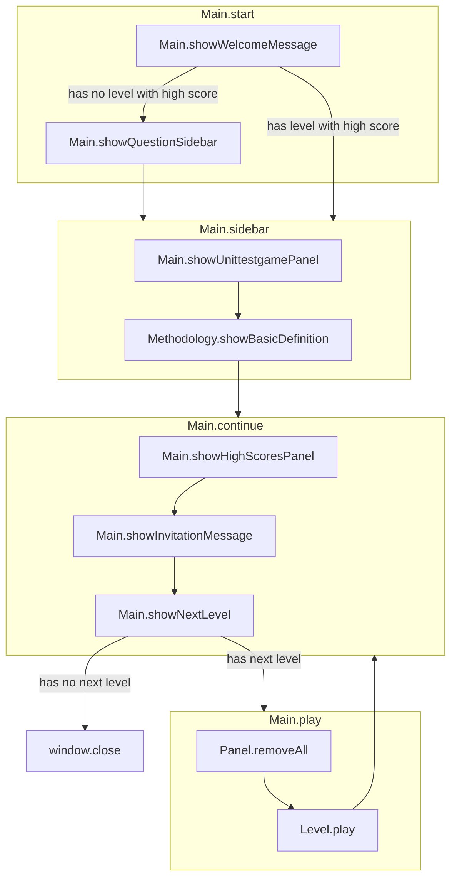
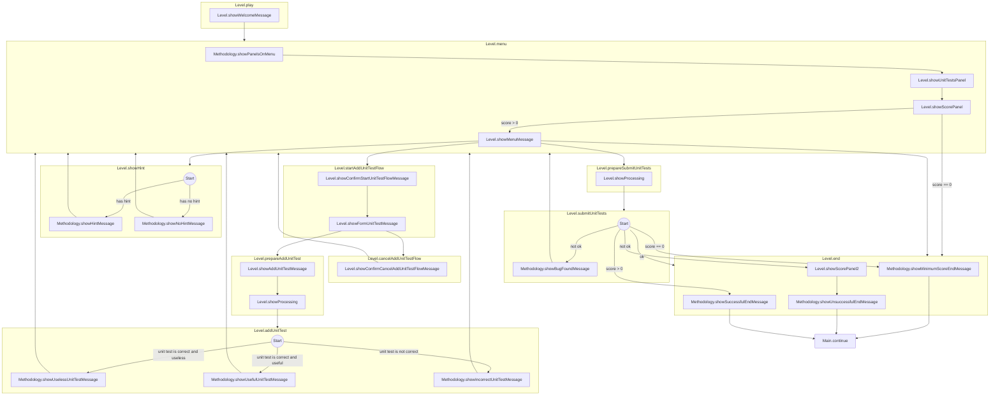

# UnitTestGame.com

Learn to write **effective unit tests** with an interactive game where you collaborate with an AI bot to improve your skills in **Test-Driven Development** and **Mutation Testing**.

Try this AI-powered feedback loop at **<https://unittestgame.com>**.

## 🚀 Test-Driven Development

The goal: **Write a function that meets the given specification.**

### How it works:
1. **You write unit tests** to define the expected behavior of the function.
2. **The AI bot writes a function** that passes the unit tests.
3. **Repeat** until you think the function is correct. 
4. **Submit** the unit tests.
5. **Validation**: The AI bot checks if the function meets the specification.
   - ✅ If correct, you’ve successfully implemented the function!
   - ❌ If incorrect, the AI bot shows **a valid unit test** that the function fails.

---

## 🧪 Mutation Testing

The goal: **Test a function thoroughly.**

### How it works:
1. **You write unit tests** to fully cover the function.
2. **The AI bot highlights covered lines** in the function.
3. **Repeat** until you think the unit tests fully cover the function.
3. **Submit** the unit tests.
4. **Validation**: The AI bot checks the function with Mutation Testing.
   - ✅ If correct, you've fully tested the function!
   - ❌ If incorrect, the AI bot generates **a mutated version** of the function that passes the unit tests.

---

Feedback? Errors? Improvements?
Mail me at <feedback@unittestgame.com>.

# Flowcharts

## Main

## Level

