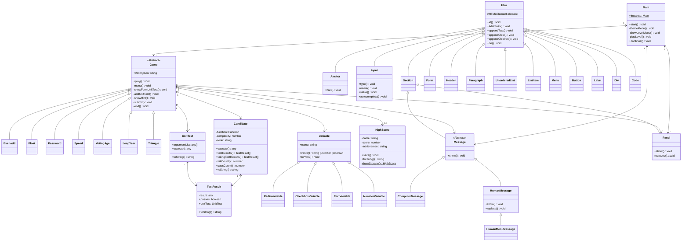
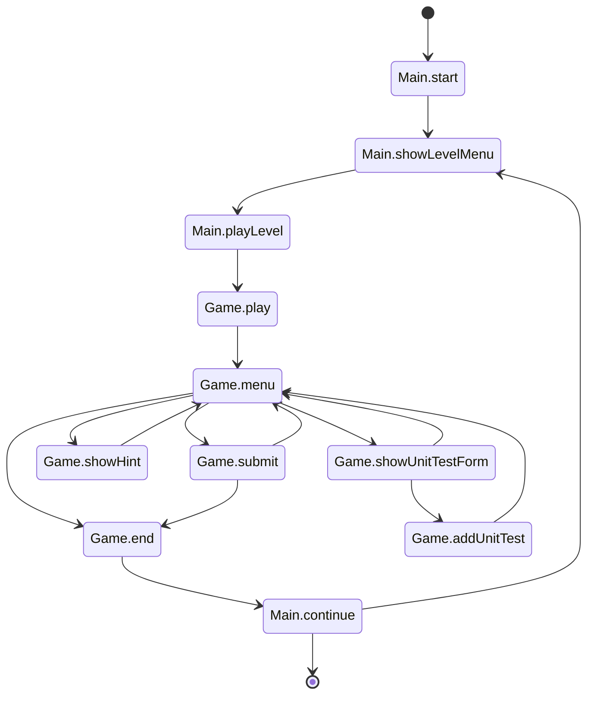

# UnitTestGame.com

## Class Diagram

```mermaid
classDiagram

class Main {
    +instance: Main$
    +start() void
    -themeMenu() void
    -showLevelMenu() void
    -playLevel() void
    +continue() void
}

class Game {
    <<Abstract>>
    +description: string*
    +play() void
    -menu() void
    -showFormUnitTest() void
    -addUnitTest() void
    -showHint() void
    -submit() void
    -end() void
}

class Evenodd
Game <|-- Evenodd

class Float
Game <|-- Float

class Password
Game <|-- Password

class Speed
Game <|-- Speed

class VotingAge
Game <|-- VotingAge

class LeapYear
Game <|-- LeapYear

class Triangle
Game <|-- Triangle

class Candidate {
    -function: Function
    -complexity: number
    -code: string
    +execute() any
    +testResults() TestResult[]
    +failingTestResults() TestResult[]
    +failCount() number
    +passCount() number
    +toString() string
}

class TestResult {
    -result: any
    +passes: boolean
    +unitTest: UnitTest
    +toString() string
}

class UnitTest {
    +argumentList: any[]
    +expected: any
    +toString() string
}

class Variable {
    +name: string
    +value() string | number | boolean*
    +toHtml() Html*
}

class RadioVariable
Variable <|-- RadioVariable

class CheckboxVariable
Variable <|-- CheckboxVariable

class TextVariable
Variable <|-- TextVariable

class NumberVariable
Variable <|-- NumberVariable

class HighScore {
    -name: string
    -score: number
    -achievement: string
    +save() void
    +toString() string
    +fromStorage() HighScore$
}

class Html {
    #HTMLElement element
    +id() void
    +addClass() void
    +appendText() void
    +appendChild() void
    +appendChildren() void
    +on() void
}

class Anchor{
    +href() void
}
Html <|-- Anchor

class Input{
    +type() void
    +name() void
    +value() void
    +autocomplete() void
}
Html <|-- Input

class Section
Html <|-- Section

class Form
Html <|-- Form

class Header
Html <|-- Header

class Paragraph
Html <|-- Paragraph

class UnorderedList
Html <|-- UnorderedList

class ListItem
Html <|-- ListItem

class Menu
Html <|-- Menu

class Button
Html <|-- Button

class Label
Html <|-- Label

class Div
Html <|-- Div

class Code
Html <|-- Code

class Message {
    <<Abstract>>
    +show() void
}
Section <|-- Message

class ComputerMessage
Message <|-- ComputerMessage

class HumanMessage {
    +show() void
    +replace() void
}
Message <|-- HumanMessage

class HumanMenuMessage
HumanMessage <|-- HumanMenuMessage

class Panel {
    +show() void
    +remove() void$
}
Section <|-- Panel

Game "1" <--> "*" Candidate
Game "1" <--> "*" UnitTest
UnitTest "1" <--> "*" TestResult
Candidate "1" <--> "*" TestResult
Game "1" <--> "*" Variable
Main "1" <--> "*" Game
Game "1" <--> "0..1" HighScore
Game "1" <--> "*" Panel
Game "1" <--> "*" Message
Main "1" <--> "*" Panel
Main "1" <--> "*" Message
```

## State Diagram

```mermaid
stateDiagram-v2
    [*] --> Main.start
    Main.start --> Main.showLevelMenu
    Main.showLevelMenu --> Main.playLevel
    Main.playLevel --> Game.play
    Main.continue --> Main.showLevelMenu
    Main.continue --> [*]
    Game.play --> Game.menu
    Game.menu --> Game.showUnitTestForm
    Game.menu --> Game.showHint
    Game.menu --> Game.submit
    Game.menu --> Game.end
    Game.showUnitTestForm --> Game.addUnitTest
    Game.showUnitTestForm --> Game.menu
    Game.addUnitTest --> Game.menu
    Game.showHint --> Game.menu
    Game.submit --> Game.menu
    Game.submit --> Game.end
    Game.end --> Main.continue
```
